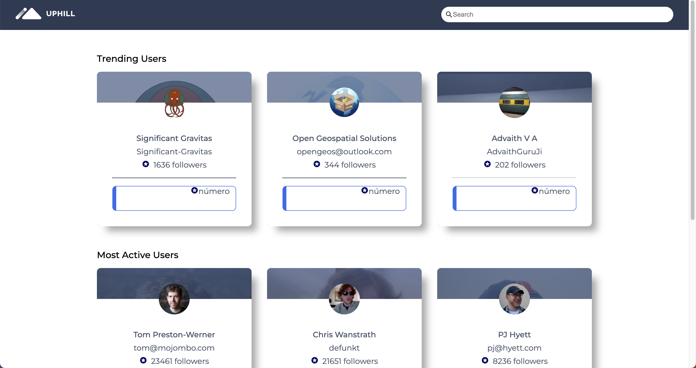

# <div align="center"> Github Dashboard React App</div>



<p align="center">This is a sample React application that connects to the Github API to fetch data from the Github website.  The project uses Next.js as a build tool, TypeScript for type checking and Styled Components for styling.</p>

## 🛠️ Technologies

<ul>
  <li><a href="https://reactjs.org/">React</a></li>
  <li><a href="https://nextjs.org/">Next.js</a></li>
  <li><a href="https://www.typescriptlang.org/">TypeScript</a></li>
  <li><a href="https://styled-components.com/
  ">Styled Components</a></li>
  <li><a href="https://api.github.com/">Github Api</a></li>
</ul>

## ⚙️ Requirements

<ul>
  <li><a href="https://nodejs.org/en/">Node.js</a></li>
  <li><a href="https://www.npmjs.com/">NPM</a></li>
</ul>

## 🚀 Installation

To get started, clone this repository and install the necessary dependencies using npm or yarn:

```
# using npm
$ npm install

# using yarn
$ yarn
```

## ⚡️ Usage

To run the application locally, use the following command:

```
# using npm
npm run dev

# using yarn
yarn dev
```

This will start a local development server on https://localhost:8000. You can then view the application in your web browser.

## 🔑 Github Authentication Token

When making requests to the GitHub API without an authentication token, you are subject to the unauthenticated rate limit, which is more restrictive than the rate limit for authenticated requests. However, if you authenticate with a personal access token, you will have a higher rate limit and can make more requests per hour. 

To generate a personal access token, follow these steps:

<ul>
<li>Go to your Github Settings.</li>
<li>Select "Developer Settings" from the left-hand menu.</li>
<li>Click on "Personal access tokens".</li>
<li>Click the "Generate new token" button.</li>
<li>Give your token a name and select the scopes you need for your application.</li>
<li>Click "Generate token" and copy the token..</li>
</ul>

Once you have generated a token, add it to a .env.local file at the root of the project. Here's an example of what the file should look like:

```
NEXT_PUBLIC_GITHUB_AUTH_TOKEN=your-token-here
```

Be sure to replace your-token-here with the personal access token you generated. You can now use the NEXT_PUBLIC_GITHUB_AUTH_TOKEN environment variable to authenticate with the Github API.

## Running Tests

This project includes automated tests to verify the functionality of the code. To run the tests locally, follow these steps:

```
# using npm
npm run test

# using yarn
yarn test

```
